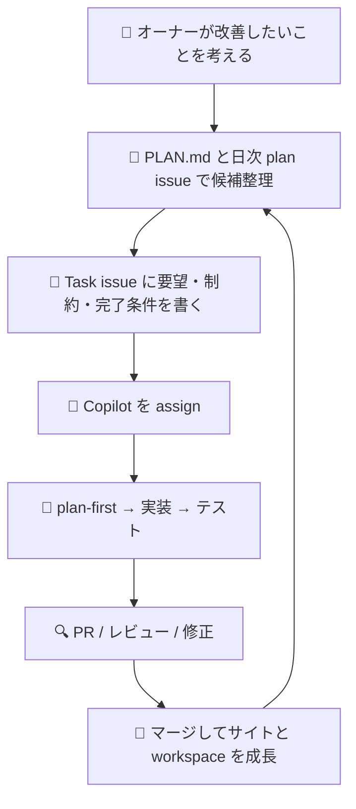
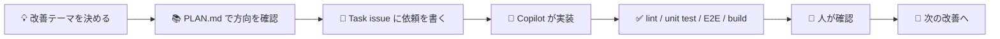
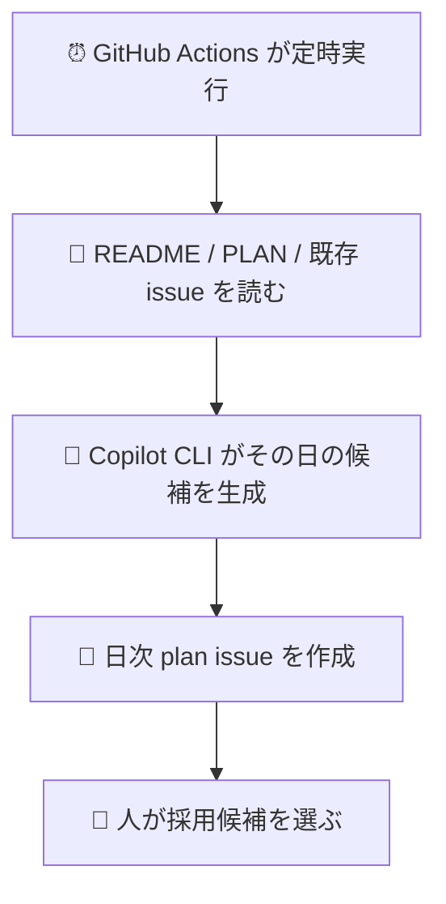

# test_ai1 📚✨

初心者にも分かりやすく、**この workspace が何をしているのか**を見た目でつかめるようにまとめた解説書です。

> [!TIP]
> 「このプロジェクトで最終的に何を目指すか」は `/home/runner/work/test_ai1/test_ai1/PLAN.md` に集約しています。  
> README は **日々の使い方・構造・進め方** を理解するための入口です。

## この README で分かること 👀

- この workspace の役割
- どのファイルに何があるか
- どうやって開発・テスト・運用するか
- Copilot と人がどう分担して進めるか

## まず一言でいうと、この workspace は何？ 🎯

**「趣味サイト本体」+「安全に育てるための開発運用セット」**です。

| 何が入っている？ | 役割 |
| --- | --- |
| React + Vite + TypeScript | 趣味サイト本体を作る |
| Zod スキーマ | コンテンツの形を崩れにくくする |
| Vitest / Playwright | 単体テスト・E2E テストを回す |
| GitHub Actions | build / test / 日次 plan issue を自動化する |
| Copilot 運用ルール | Plan-first、Task issue、PR レビューの流れを揃える |
| README / PLAN / instructions | 人が読んでも AI が読んでも迷いにくくする |

## 全体像を図で見る 🗺️



## workspace の中身をやさしく分解すると 🧩

| レイヤー | 主な場所 | 何をしているか |
| --- | --- | --- |
| サイト画面 | `/home/runner/work/test_ai1/test_ai1/src/pages` | トップ、趣味一覧、趣味詳細、テストレポート画面を持つ |
| アプリの土台 | `/home/runner/work/test_ai1/test_ai1/src/app` | ルーティング、レイアウト、アプリ全体の入口をまとめる |
| コンテンツ定義 | `/home/runner/work/test_ai1/test_ai1/src/content` | 趣味データのスキーマ検証と seed データ管理を行う |
| 自動化スクリプト | `/home/runner/work/test_ai1/test_ai1/scripts` | 日次 plan issue を作る処理を置く |
| E2E テスト | `/home/runner/work/test_ai1/test_ai1/tests/e2e` | 実際の画面導線が崩れていないか確認する |
| 運用ドキュメント | `/home/runner/work/test_ai1/test_ai1/README.md` / `/home/runner/work/test_ai1/test_ai1/PLAN.md` / `.github/copilot-instructions.md` | 人と Copilot が同じ前提で作業できるようにする |

## ディレクトリ構成の見取り図 🏗️

```text
test_ai1/
├─ src/
│  ├─ app/        # ルーター・レイアウト・アプリ入口
│  ├─ content/    # Zod スキーマとコンテンツ
│  └─ pages/      # 画面コンポーネント
├─ tests/e2e/     # Playwright のスモークテスト
├─ scripts/       # GitHub 運用の補助スクリプト
├─ PLAN.md        # 目指す姿・進行方針
└─ README.md      # 使い方と全体像の案内板
```

## 実際の開発フロー 🔄



## まず触るならここから 🚀

### 1. セットアップ

| やること | コマンド | 補足 |
| --- | --- | --- |
| 依存関係を入れる | `npm install` | 最初に 1 回実行 |
| 開発サーバーを起動 | `npm run dev` | ブラウザで画面確認 |
| lint を実行 | `npm run lint` | コードの書き方チェック |
| 単体テストを実行 | `npm run test` | Vitest を使用 |
| E2E テストを実行 | `npm run test:e2e` | Playwright を使用 |
| 本番 build を確認 | `npm run build` | 配布前の最終確認 |

### 2. 何を見ると理解しやすい？

| 目的 | 最初に見る場所 |
| --- | --- |
| プロジェクトの方針を知りたい | `/home/runner/work/test_ai1/test_ai1/PLAN.md` |
| Copilot の作業ルールを知りたい | `/home/runner/work/test_ai1/test_ai1/.github/copilot-instructions.md` |
| 画面遷移を知りたい | `/home/runner/work/test_ai1/test_ai1/src/app/router.tsx` |
| コンテンツの型を知りたい | `/home/runner/work/test_ai1/test_ai1/src/content/schema.ts` |
| 日次 issue 自動化を知りたい | `/home/runner/work/test_ai1/test_ai1/scripts/create-daily-plan-issue.mjs` |

## この workspace が自動でやっていること 🤖

| 自動化 | 内容 |
| --- | --- |
| 日次 plan issue | 毎日の候補整理を GitHub Actions で補助する |
| build / test | 壊れていないかを継続的に確認しやすくする |
| E2E レポート導線 | `/report` から Playwright レポートへ移動できる |

## 日次 plan issue って何？ 📅

初心者向けに言うと、**「今日は何を直す・進めるか」を毎日提案してくれるメモの自動作成機能**です。



### 関連ファイル

| ファイル | 役割 |
| --- | --- |
| `.github/workflows/daily-plan-issue.yml` | 日次実行の workflow |
| `scripts/create-daily-plan-issue.mjs` | issue 本文を作って起票する処理 |
| `.github/prompts/daily-plan-issue.prompt.md` | Copilot に渡すプロンプト |

## 人と Copilot の分担 🤝

| 担当 | 役割 |
| --- | --- |
| 人 | 方針を決める / 候補を選ぶ / 最終確認してマージする |
| Copilot | plan-first / 実装 / テスト / PR 更新を進める |
| README / PLAN / instructions | 両者の前提を揃える共通メモになる |

## この README の読み方おすすめ順 📖

1. **この README** で全体像をつかむ
2. **PLAN.md** で中長期の方向性を確認する
3. **.github/copilot-instructions.md** で運用ルールを確認する
4. **src/app / src/pages / src/content** を見て実装の実体を知る

## 迷ったらこの理解で OK 🙌

> この repo は、  
> **趣味サイトを作るためのアプリ**であり、同時に  
> **Copilot と一緒に安全に改善を回すための workspace** です。

そのため、コードだけでなく **運用ルール・自動化・テスト・ドキュメント** も同じくらい大事にしています。
