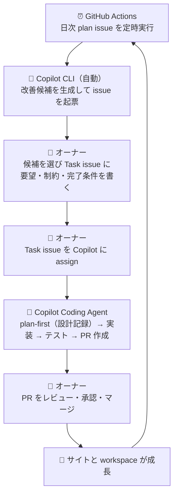
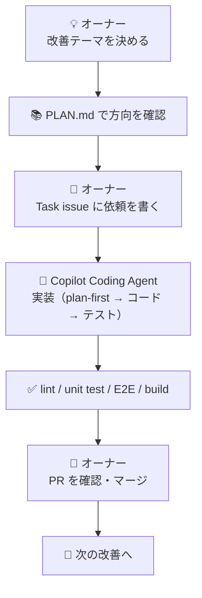
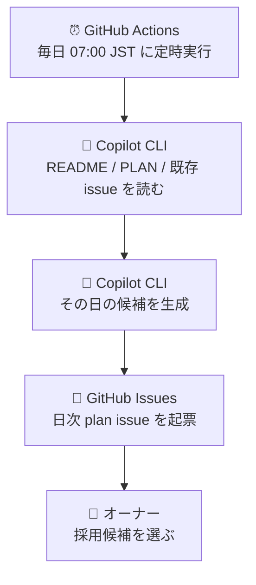

# test_ai1 📚✨

**この workspace が何をしているのか**を見た目でつかめるようにまとめた解説書です。

> [!TIP]
> 「このプロジェクトで最終的に何を目指すか」は `./PLAN.md` に集約しています。  
> README は **日々の使い方・構造・進め方** を理解するための入り口です。

## この README で分かること 👀

- この workspace の役割
- どのファイルに何があるか
- どうやって開発・テスト・運用するか
- オーナーと Copilot がどう役割を分担するか
- Copilot には 2 種類あり、それぞれどのタスクを担うか

## まず一言でいうと、この workspace は何？ 🎯

**「趣味サイト本体」+「安全に育てるための開発運用セット」**です。

| 何が入っている？ | 役割 |
| --- | --- |
| React + Vite + TypeScript | 趣味サイト本体を作る |
| Zod スキーマ | コンテンツの形を崩れにくくする |
| Vitest / Playwright | 単体テスト・E2E テストを回す |
| GitHub Actions | build / test / 日次 plan issue を自動化する |
| Copilot 運用ルール | Plan-first、Task issue、PR レビューの流れを揃える |
| README / PLAN / instructions | 人が読んでも AI が読んでも迷いにくくする |

## 運用全体像を図で見る 🗺️



## workspace の中身をやさしく分解すると 🧩

| レイヤー | 主な場所 | 何をしているか |
| --- | --- | --- |
| サイト画面 | `src/pages` | トップ、趣味一覧、趣味詳細、テストレポート画面を持つ |
| アプリの土台 | `src/app` | ルーティング、レイアウト、アプリ全体の入り口をまとめる |
| コンテンツ定義 | `src/content` | 趣味データのスキーマ検証と seed データ管理を行う |
| 自動化スクリプト | `scripts` | 日次 plan issue を作る処理を置く |
| E2E テスト | `tests/e2e` | 実際の画面導線が崩れていないか確認する |
| 運用ドキュメント | `./README.md` / `./PLAN.md` / `./.github/copilot-instructions.md` | 人と Copilot が同じ前提で作業できるようにする |

## 主要ディレクトリ構成の見取り図（抜粋）🏗️

```text
test_ai1/
├─ .github/
│  ├─ workflows/   # GitHub Actions
│  ├─ prompts/     # Copilot 用プロンプト
│  └─ copilot-instructions.md
├─ src/
│  ├─ app/        # ルーター・レイアウト・アプリ入り口
│  ├─ content/    # Zod スキーマとコンテンツ
│  └─ pages/      # 画面コンポーネント
├─ tests/e2e/     # Playwright のスモークテスト
├─ scripts/       # GitHub 運用の補助スクリプト
├─ package.json   # npm scripts と依存関係
├─ vite.config.ts # Vite 設定
├─ playwright.config.ts
├─ PLAN.md        # 目指す姿・進行方針
└─ README.md      # 使い方と全体像の案内板
```

## 実際の開発フロー 🔄



## まず触るならここから 🚀

### 1. セットアップ

| やること | コマンド | 補足 |
| --- | --- | --- |
| 依存関係を入れる | `npm install` | 最初に 1 回実行 |
| 開発サーバーを起動 | `npm run dev` | ブラウザで画面確認 |
| lint を実行 | `npm run lint` | コードの書き方チェック |
| 単体テストを実行 | `npm run test` | Vitest を使用 |
| E2E テストを実行 | `npm run test:e2e` | Playwright を使用 |
| 本番 build を確認 | `npm run build` | 配布前の最終確認 |

### 2. 何を見ると理解しやすい？

以下は **repo ルートから見た実在パス** です。

| 目的 | 最初に見る場所 |
| --- | --- |
| プロジェクトの方針を知りたい | `./PLAN.md` |
| Copilot の作業ルールを知りたい | `./.github/copilot-instructions.md` |
| 画面遷移を知りたい | `src/app/router.tsx` |
| コンテンツの型を知りたい | `src/content/schema.ts` |
| 日次 issue 自動化を知りたい | `scripts/create-daily-plan-issue.mjs` |

## この workspace が自動でやっていること 🤖

| 自動化 | 内容 |
| --- | --- |
| 日次 plan issue | 毎日の候補整理を GitHub Actions で補助する |
| build / test | 壊れていないかを継続的に確認しやすくする |
| E2E レポート導線 | `/report` から Playwright レポートへ移動できる |

## 日次 plan issue って何？ 📅

**「今日は何を直す・進めるか」を毎日提案してくれるメモの自動作成機能**です。



### 関連ファイル

以下も **repo ルート基準の実在パス** です。

| ファイル | 役割 |
| --- | --- |
| `./.github/workflows/daily-plan-issue.yml` | 日次実行の workflow |
| `scripts/create-daily-plan-issue.mjs` | issue 本文を作って起票する処理 |
| `./.github/prompts/daily-plan-issue.prompt.md` | Copilot に渡すプロンプト |

## Copilot の種類と役割 🤖

この workspace では **2 種類の Copilot** が動いています。

| 種類 | 何者か | どこで動くか | 担当タスク |
| --- | --- | --- | --- |
| **Copilot CLI** | `@github/copilot` npm パッケージ | GitHub Actions（日次 workflow） | 毎日の改善候補を生成して plan issue を起票する |
| **Copilot Coding Agent** | GitHub の AI エージェント | **Agents タブ**（issue assign で起動） | plan-first → 実装 → テスト → PR 作成を自律で進める |

### Copilot CLI とは？

- `@github/copilot` という npm パッケージで提供される CLI ツールです
- GitHub Actions の workflow から `node scripts/create-daily-plan-issue.mjs` で呼び出されます
- Copilot API を使って `PLAN.md` / `README.md` / open issues を読み、その日の改善候補を日本語で生成します
- IDE の Copilot 補完や Chat とは **別物**です

### Copilot Coding Agent とは？

- GitHub リポジトリの **Agents タブ** から動作状況を確認できる AI エージェントです
- オーナーが Task issue を Copilot に **assign** することで起動します
- 動作内容：issue の本文・コメントを読む → plan-first（設計をコメントに書く）→ コードを実装 → テスト・lint・build を実行 → PR を作成 → Copilot 自身によるコードレビュー
- PR 作成後の追加指示は **issue ではなく PR コメント** に書くこと

## オーナーと Copilot の役割分担 🤝

| タスク | 担当 | 使うツール / 場所 |
| --- | --- | --- |
| 改善案の提案 | 🤖 Copilot CLI（自動） | GitHub Actions → 日次 plan issue |
| 候補の選定 | 👤 オーナー | 日次 plan issue を読んで決める |
| 依頼内容の記録 | 👤 オーナー | Task issue コメント欄（採用候補・要望・制約・完了条件） |
| Task issue の assign | 👤 オーナー | GitHub Issues |
| plan-first（設計記録） | 🤖 Copilot Coding Agent | Issue コメント / Agents タブで確認 |
| 実装・テスト | 🤖 Copilot Coding Agent | ブランチ / Agents タブで確認 |
| PR 作成・自己レビュー | 🤖 Copilot Coding Agent | GitHub Pull Requests |
| PR の最終確認・マージ | 👤 オーナー | GitHub Pull Requests |
| 軌道修正・追加指示 | 👤 オーナー | **PR コメント**（issue ではない） |

> [!NOTE]
> assign 後の追加指示は **PR コメント** に書いてください。  
> issue に書いても Copilot は読み取りません。

## この README の読み方おすすめ順 📖

1. `README.md` で全体像をつかむ（← 今ここ）
2. `./PLAN.md` で中長期の方向性を確認する
3. `./.github/copilot-instructions.md` で Copilot への運用ルールを確認する
4. `src/app` / `src/pages` / `src/content` を見て実装の実体を知る

## ⚠️ 注意事項

| 注意点 | 内容 |
| --- | --- |
| 追加指示は PR コメントへ | assign 後の要望変更・修正依頼は issue ではなく PR コメントに書く |
| secrets の管理 | `COPILOT_CLI_TOKEN` は repo secrets に設定する。コードには絶対に書かない |
| assign 前にコメントを書く | Task issue を assign する **前に** 要望・制約・完了条件をコメントとして残す |
| マージ判断はオーナーが行う | Copilot は PR を作るが、最終的なマージ判断はオーナーの責任 |
| plan-first は必ず確認する | 複数ファイルに影響する変更は、Copilot が issue に書いた plan-first コメントを確認してから進める |
| CLI と Coding Agent は別物 | Copilot CLI は GitHub Actions 上の自動処理。Coding Agent は Agents タブで動く。混同しないこと |

## 迷ったらこの理解で OK 🙌

> この repo は、  
> **趣味サイトを作るためのアプリ**であり、同時に  
> **Copilot と一緒に安全に改善を回すための workspace** です。

コードだけでなく **運用ルール・自動化・テスト・ドキュメント** も同じくらい大事にしています。
